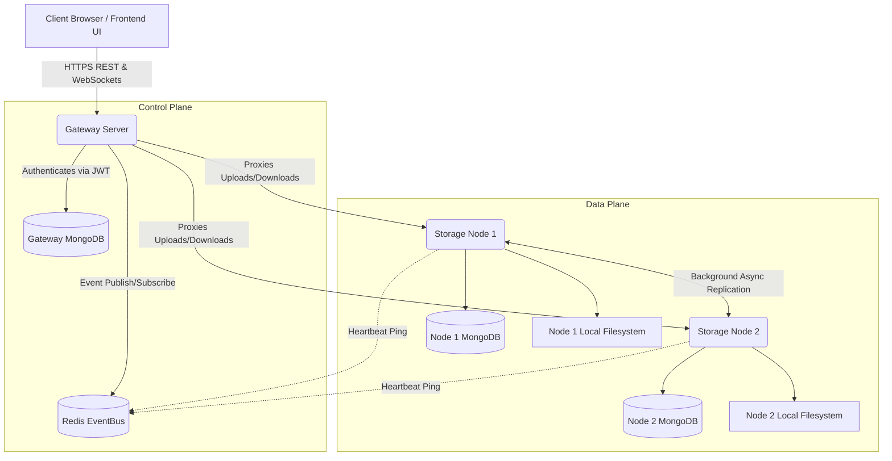

# DistriDoc: Distributed Student Document Repository

**DistriDoc** is a production-grade, highly scalable distributed document storage system designed for educational institutions. It features a distributed architecture with decentralized storage nodes, automated fault-tolerance, dynamic service discovery, and a premium real-time observability dashboard.

---

## 🏗 System Architecture

DistriDoc operates on a master-worker distributed pattern, coordinated by a central API Gateway.



### Components
1. **Frontend UI (React + Vite)**: A premium SaaS interface featuring real-time node monitoring, animated network topology, and role-based access control.
2. **Gateway Server**: The centralized entry point. It handles load balancing, JWT authentication, rate limiting, and dynamic node registration.
3. **Storage Nodes**: Autonomous, decentralized workers that physically store the documents on their local file systems and metadata in their respective databases.
4. **Redis EventBus**: The distributed nervous system handling Node Heartbeats, failover events, and real-time frontend synchronization.
5. **MongoDB Clusters**: Sharded databases separating Gateway authentication data from Storage Node metadata.

---

## 🧠 Distributed Systems Concepts Applied

### 1. CAP Theorem Relevance
DistriDoc prioritizes **Partition Tolerance (P)** and **Availability (A)** over strict consistency, making it an AP system.
- **Eventual Consistency**: When a file is uploaded to `Node 1`, the gateway immediately responds to the client. `Node 1` then asynchronously queues a background task to replicate the file to `Node 2`. There is a brief window where the replica is not yet synchronized, but system availability remains high.
- **Partition Tolerance**: If the network connection between `Node 1` and `Node 2` drops, they continue to operate independently and sync when the connection is restored.

### 2. Dynamic Service Discovery
Storage nodes are not hardcoded. When a Storage Node boots, it emits a `NODE_HEARTBEAT` over the Redis EventBus. The Gateway dynamically discovers the node, registers its IP and storage capacity, and immediately begins routing traffic to it.

### 3. Fault Tolerance & Automated Failover
- **Heartbeat Monitoring**: Storage Nodes pulse a heartbeat every 5 seconds.
- **Failover Routing**: If the Gateway misses heartbeats for 30 seconds, it flags the node as `OFFLINE`. If a user requests a file stored on the failed node, the Gateway automatically reroutes the request to a surviving replica node.
- **Graceful Degradation**: The system continues to operate seamlessly even if 50% of the storage cluster is destroyed.

### 4. Distributed Security & Zero-Trust
- **Service Authentication**: Internal communication between the Gateway and Storage Nodes is protected by cryptographic `SERVICE_SECRET` tokens, preventing lateral attacks on the internal network.
- **Rate Limiting**: Distributed API throttling prevents DDoS attacks and brute-force login attempts.
- **Audit Logging**: A centralized immutable ledger tracks all high-privilege administrative actions.

---

## 🚀 Quick Start (Local Docker Compose)

### Prerequisites
- Docker & Docker Compose
- Node.js (for local development)

### Deployment
1. Clone the repository.
2. Ensure you have a `.env` file at the root with required secrets (e.g., `SERVICE_SECRET`, `MONGO_URI`, `REDIS_URL`).
3. Build and launch the cluster:
   ```bash
   docker compose -f docker-compose.local.yml up -d --build
   ```
4. Access the premium frontend at `http://localhost:3000`.

---

## 📂 Documentation Directory
- [API Reference](./docs/API_REFERENCE.md)
- [Deployment Guide](./docs/DEPLOYMENT_GUIDE.md)

---
*Built as an advanced showcase of distributed computing concepts including network telemetry, distributed state synchronization, and fault-tolerant cloud architecture.*
