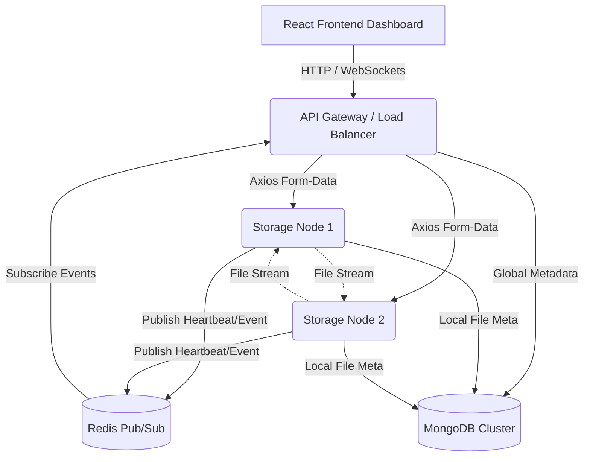

# Distributed Student Document Repository (DistriDoc)

An industry-grade, fault-tolerant Distributed Document Management System built as a capstone Distributed Systems mini-project. It demonstrates core principles of modern distributed computing, including horizontal scaling, real-time node monitoring, fault tolerance, load balancing, and active file replication.

---

## 🏛 System Architecture

The architecture relies on a central API Gateway that acts as a Load Balancer and router, backed by multiple independent Storage Nodes communicating via a Redis Event Bus.

---

## 📚 Distributed Systems Concepts Implemented

### 1. CAP Theorem Analysis
According to the CAP theorem (Consistency, Availability, Partition Tolerance), a distributed data store can only guarantee two of the three. **DistriDoc prioritizes Availability and Partition Tolerance (AP System)**.
- **Availability:** If a storage node goes offline, the API Gateway instantly detects it and routes downloads to a replica node, ensuring users can always access their files.
- **Partition Tolerance:** If network communication between Node 1 and Node 2 breaks, they can still independently accept uploads from the Gateway.
- **Eventual Consistency:** Replication happens asynchronously in the background. If a user tries to download a file from Node 2 the exact millisecond after it was uploaded to Node 1, it might not be there yet. The system relies on *Eventual Consistency* tracked via Redis events.

### 2. Fault Tolerance & Failover
- **Active Heartbeat Monitoring:** Storage nodes broadcast their status to a Redis `node:heartbeat` channel every 5 seconds. The Gateway passively listens. If 15 seconds pass without a heartbeat, the Gateway marks the node as `offline`.
- **Automated Failover:** When a user requests a file, the Gateway checks if the Primary Node is online. If offline, it dynamically parses the `replicaNodes` array and streams the file from an available secondary node, entirely transparently to the user.

### 3. Load Balancing & Hashing
- Currently, the Gateway utilizes a **Round-Robin** algorithm to distribute incoming uploads evenly across all available nodes, preventing server exhaustion.
- **Consistent Hashing Integration (Theory):** In a production scale-out scenario with 50+ nodes, Round-Robin becomes inefficient for caching. The architecture is prepared to swap Round-Robin for *Consistent Hashing*, where a hash function maps a Document ID to a specific coordinate on a Hash Ring, dramatically reducing data migration when new nodes are added or removed dynamically.

### 4. Active Replication Strategy
- **Decoupled Push Replication:** When an upload lands on a Primary Node, it is immediately written to local disk. The node then triggers a background worker (`replicator.js`) that opens a network stream and pushes a replica to a peer node.
- **Event-Driven Callbacks:** Instead of HTTP Webhooks (which can fail), the node publishes a `replication:completed` event to Redis, which the Gateway consumes to update the central global state.

### 5. Scalability & Concurrency
- The Gateway implements an **Upload Queue** with a strict concurrency limit (e.g., 5 simultaneous network streams).
- It uses a **Distributed Lock Map** (`Set<userId:filename>`) to prevent race conditions or duplicate writes if a client spams the upload button.
- The system is Dockerized; adding a `storage-node-3` is as simple as adding 10 lines to the `docker-compose.yml`.

---

## 🎓 Faculty Demonstration Flow (Viva Guide)

Follow this script to perfectly demonstrate the distributed capabilities of this project to your faculty:

### Step 1: Initial Spin-up
1. Run `docker-compose up -d --build`.
2. Show the faculty the terminal output indicating 6 separate containers running (`mongodb`, `redis`, `gateway`, `node-1`, `node-2`, `frontend`).
3. Explain that this represents an industry microservice architecture.

### Step 2: Show the Real-Time Dashboard
1. Open `http://localhost:3000`.
2. Navigate to the **Distributed Node Monitor**.
3. Point out that both `storage-node-1` and `storage-node-2` are currently marked **ONLINE** in green.
4. Explain that this is driven by **Socket.IO** receiving real-time heartbeats from the Redis Event Bus.

### Step 3: Demonstrate Round-Robin & Replication
1. Navigate to the **Upload Center**.
2. Upload a test document (`file_A.pdf`).
3. Quickly navigate to the **Documents** list. 
4. Point out the `Primary Node` column. It will say `storage-node-1`.
5. Point out the Replication badge changing from **Syncing** to **Replicated** (driven by Redis events).
6. Upload a second file (`file_B.pdf`). Show that the Gateway's load balancer assigned it to `storage-node-2`.

### Step 4: The "Kill Switch" (Demonstrating Fault Tolerance)
This is the most impressive part of the demo.
1. Open a terminal and forcefully kill node 1: `docker stop distridoc-node-1`.
2. Quickly switch back to the React UI **Node Monitor** page.
3. Wait 15 seconds. The UI will instantly flash and update `storage-node-1` to **OFFLINE (Red)** without refreshing the page!
4. Navigate to the **Documents** list.
5. Click **Download** on `file_A.pdf` (which was originally saved on the now-dead Node 1).
6. **The download will still succeed!** Explain to the faculty that the Gateway detected Node 1 was dead, engaged Failover Logic, and streamed the file from Node 2's replica instead.

### Step 5: Dynamic Recovery (Self-Healing)
1. In the terminal, bring the node back: `docker start distridoc-node-1`.
2. Watch the **Node Monitor** dashboard.
3. Within 5 seconds, the node will turn **ONLINE** again. Explain that the node resumed broadcasting its heartbeat, and the system dynamically healed itself.

---

## 🛠 Tech Stack
- **Frontend:** React, TailwindCSS, Framer Motion, Socket.IO Client, Recharts
- **API Gateway:** Node.js, Express, Axios, Socket.IO Server, Multer (Memory)
- **Storage Nodes:** Node.js, Express, Multer (Disk Storage)
- **State & Events:** MongoDB, Mongoose, Redis (Pub/Sub)
- **Infrastructure:** Docker, Docker Compose, Nginx
